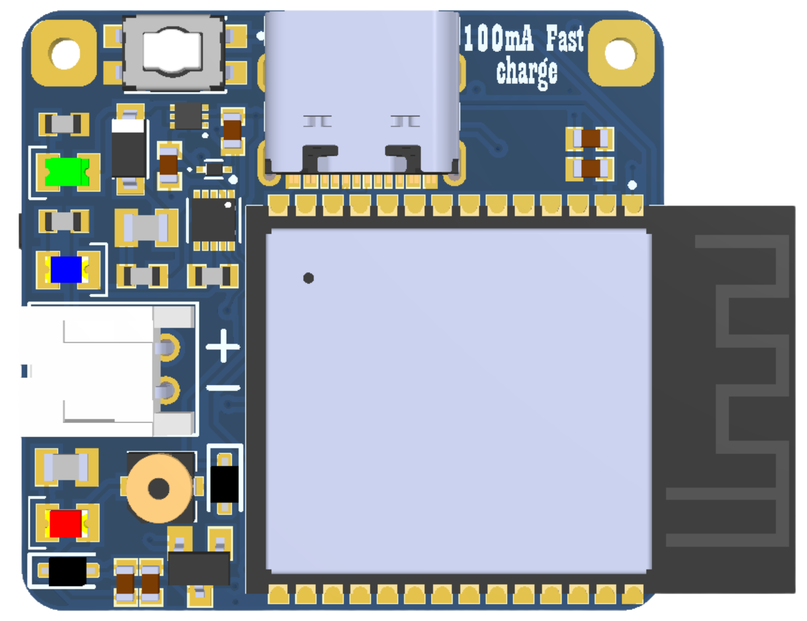
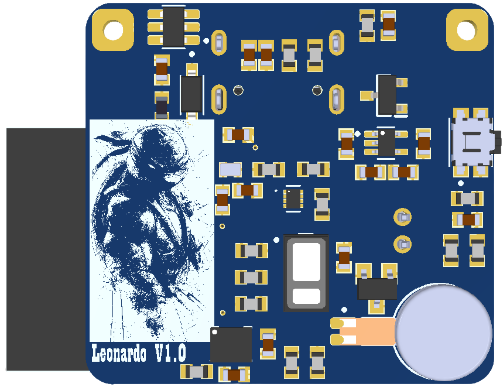

<div align="center">

# 🫀 Leonardo V1.0 — Wearable Fall Detection & Biometric Telemetry System

**An ultra-low-power, RISC-V edge-computing IoT wearable for geriatric care, autonomous fall detection, and continuous vital signs monitoring.**

[](#)
[-red.svg?style=for-the-badge&logo=espressif)](#)
[](#)
[](#)
[](https://opensource.org/licenses/MIT)

<br/>

| Top View (MCU, USB-C, Power Path) | Bottom View (Optical PPG, IMU, Actuators) |
| :---: | :---: |
|  |  |

</div>

---

## 📋 Table of Contents
- [Project Overview](#-project-overview)
- [System Architecture](#-system-architecture)
- [Key Hardware Features](#-key-hardware-features)
- [Hardware Subsystems Breakdown](#-hardware-subsystems-breakdown)
- [Pinout & Interconnect Mapping](#-pinout--interconnect-mapping)
- [I2C Address Map](#-i2c-address-map)
- [Fall Detection State Machine](#-fall-detection-state-machine)
- [Repository Structure](#-repository-structure)
- [Getting Started](#-getting-started)
- [License](#-license)

---

## 🌟 Project Overview

**Leonardo V1.0** is an open-source, custom-engineered medical IoT wearable designed for real-time geriatric safety. Elderly falls represent a critical health risk often accompanied by immediate cardiovascular complications. 

This board integrates **high-frequency 6-DoF inertial measurement** with **photoplethysmography (PPG) optical pulse oximetry** in an ultra-compact wrist/chest-worn form factor.

### Primary Objectives:
* **Zero-Latency Fall Detection:** Low-power interrupt-driven inertial monitoring that differentiates daily living activities (ADL) from traumatic impact events.
* **Continuous Photoplethysmography (PPG):** High-precision SpO₂ (Blood Oxygen) and Heart Rate (BPM) measurement placed on the PCB's bottom side for optimal dermal contact.
* **Autonomous Emergency Response:** Instantaneous dual-alert actuation (Haptic ERM + Acoustic Piezo Buzzer) with a hardware panic cancel switch.
* **Next-Gen Connectivity:** Powered by the **ESP32-C6** RISC-V SoC, supporting **Wi-Fi 6 (802.11ax)**, **Bluetooth 5 (LE)**, and **IEEE 802.15.4 (Zigbee/Thread)** for smart hospital and home-care telemetry.

---

## 🏗️ System Architecture

```text
+===================================================================================================+
|                                    LEONARDO V1.0 HARDWARE ARCHITECTURE                            |
+===================================================================================================+
|                                                                                                   |
|  [USB Type-C (5V)] ---> [ESD Clamp (ESDA6V1)]                                                     |
|           |                                                                                       |
|           +---------> [TI BQ24040 Charger (100mA)] <=======> [Li-Po Battery Connector (2-Pin)]    |
|           |                       |                                      |                        |
|           |                       +------------+                         |                        |
|           v                                    |                         v                        |
|   [V_BUS Detection]                     [Charge Status]        [PJA3441 P-MOSFET Switch]          |
|           |                                                              |                        |
|           +--------------------------------------------------------------+                        |
|                                          |                                                        |
|                                          v [V_SYS Rail]                                           |
|                         +---------------------------------+                                       |
|                         |                                 |                                       |
|                         v                                 v                                       |
|           [MIC5504-3.3YM5 LDO (3.3V)]        [TLV70018 LDO (1.8V)]                                |
|                         |                                 |                                       |
|                         +---------------+                 +---------------+                       |
|                                         |                                 |                       |
+-----------------------------------------|---------------------------------|-----------------------+
| 3.3V SYSTEM DOMAIN                      v                                 v 1.8V ANALOG DOMAIN    |
|                               +-------------------+             +-------------------+             |
|                               |   ESP32-C6 MCU    |             | MAX30102 Biosense |             |
|                               |   (RISC-V Core)   |             | (PPG SpO2 & HR)   |             |
|                               +-------------------+             +-------------------+             |
|                                 |   |   |   |   |                         |  |                    |
|       +-------------------------+   |   |   |   +------+                  |  |                    |
|       |                             |   |   |          |                  |  |                    |
|       v                             v   v   v          v                  v  v                    |
|  [BMI270 6-DoF IMU] <=================[PCA9306 Level Translator]==========+==+                    |
|  (Accel + Gyro @ 3.3V)                 (3.3V <---> 1.8V I2C Bus)                                  |
|                                                                                                   |
|  OUTPUT ACTUATION & IO:                                                                           |
|  - Coin ERM Vibration Motor (AO3400 N-MOSFET Driver)                                              |
|  - Micro Piezo Buzzer (Transistor Driven)                                                         |
|  - Emergency SOS / Alarm Cancel Switch (RC Debounced)                                             |
|  - 32.768 kHz External RTC Oscillator (Deep Sleep Wakeup)                                         |
|  - Native USB CDC / JTAG Interface (D+ / D-)                                                      |
+===================================================================================================+
